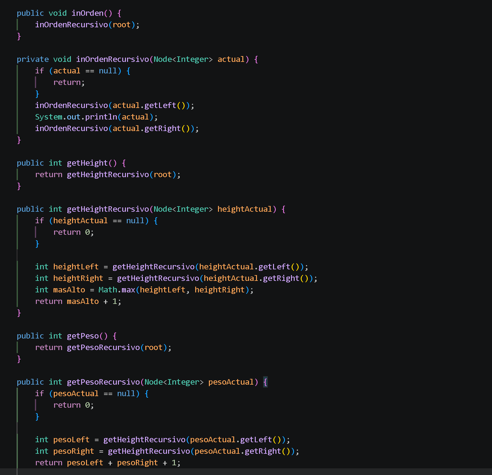
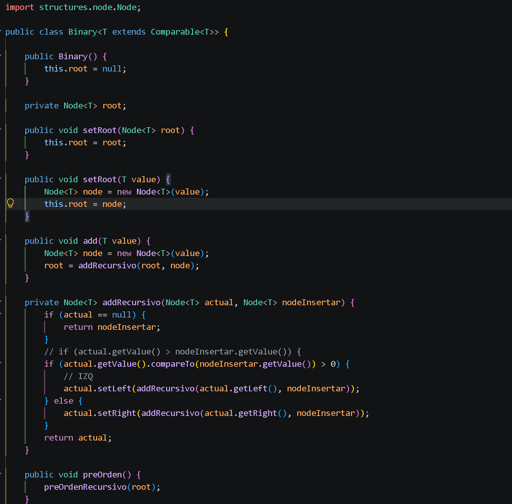
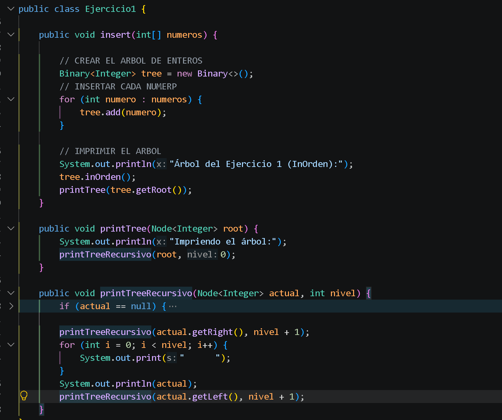
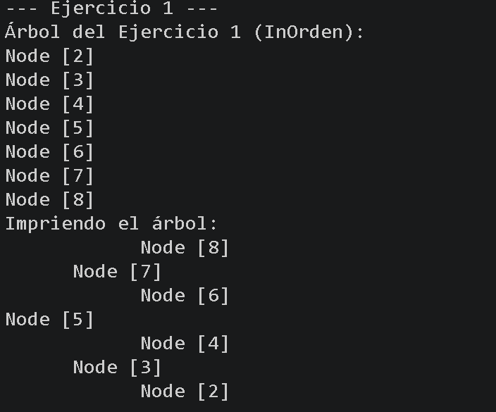
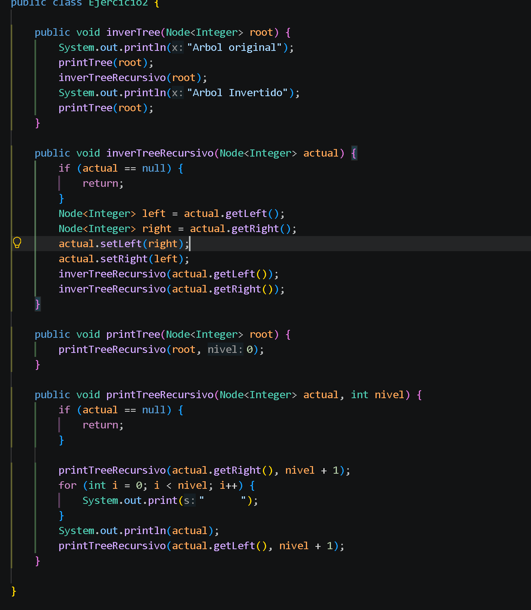
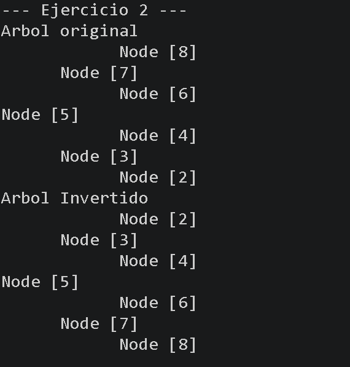
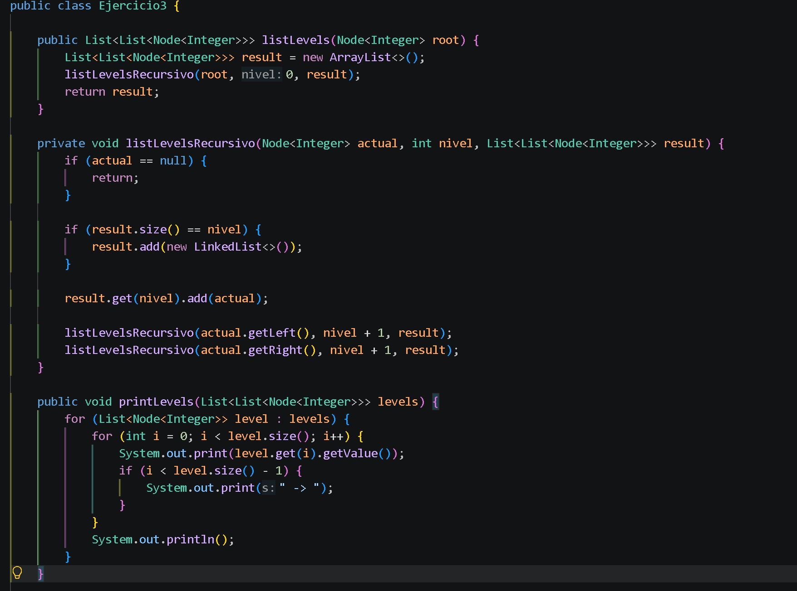
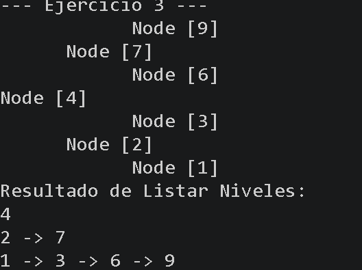
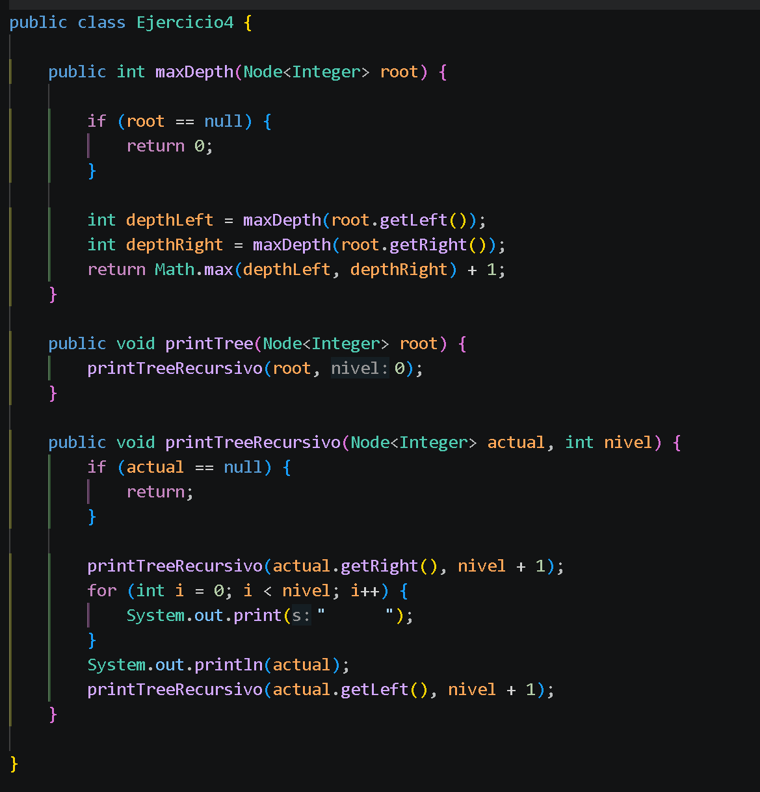
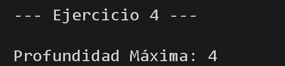

## Practica: Estructuras No Líneales
# Datos del Estudiante

    + Nombre: Carlos Tello
    + Curso: Estructura de Datos

## Creacion de arboles de numeros y de personas

**Fecha: 17 de Junio de 2026**

En esta práctica construimos una estructura para organizar números. Hicimos que, al ir agregando cada número nuevo, este busque su lugar y se acomode automáticamente: los más pequeños se van hacia el lado izquierdo y los más grandes hacia el derecho. Para lograr que esto se haga solo, usamos recursividad

### 2. Árbol Binario Genérico (`Binary<T>`)
Esta es una versión más avanzada y flexible que la anterior. Al utilizar variables genericas de Java, nos permite reutilizar exactamente el mismo código para organizar cualquier tipo de dato como palabras de texto etc, siempre y cuando estos elementos tengan una regla clara para compararse entre sí.

## Resolución de Ejercicios:

**Fecha: 22 de Junio de 2026**

### Ejercicio 01: Insertar en un Árbol Binario de Búsqueda
Hicimos un algoritmo capaz de recibir un arreglo de números y construirlos dentro de un Árbol Binario de Búsqueda. El código recorre cada elemento del arreglo y utiliza nuestra lógica para  ubicar los valores menores a la izquierda, mayores a la derecha, finalizando con la impresión del árbol para comprobar su estructura.

**Estructura del Código:**

**Resultado en Consola:**

### Ejercicio 02: Invertir un Árbol Binario
Hicimos un método para invertir completamente la estructura de un árbol binario. Utilizando recursividad, el algoritmo desciende por cada nodo y realiza un intercambio directo entre su hijo izquierdo y su hijo derecho
**Estructura del Código:**

**Resultado en Consola:**

**Fecha: 23 de Junio de 2026**

### Ejercicio 03: Listar Niveles en Listas Enlazadas
Hicimos un algoritmo que recorre el árbol y agrupa los nodos dependiendo de su nivel. Usamos listas pequeñas para guardar los datos de cada piso por separado y así poder mostrarlos en la pantalla ordenados, nivel por nivel, y conectados por flechas.

**Estructura del Código:**

**Resultado en Consola:**

### Ejercicio 04: Calcular la Profundidad Máxima
Aquí el objetivo era descubrir qué tan profundo llega nuestro árbol, hicimos que el programa revise el camino izquierdo y el derecho. Al final, el programa simplemente compara ambas rutas, escoge la más larga y nos dice cuántos niveles bajamos en total.

**Estructura del Código:**

**Resultado en Consola:**

